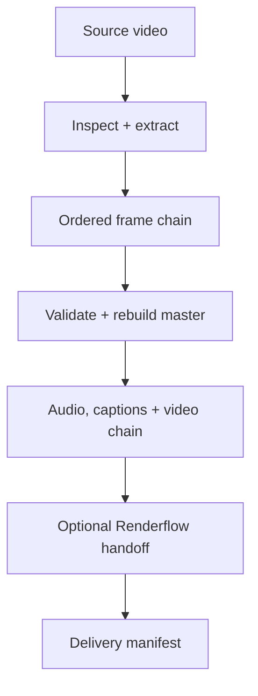
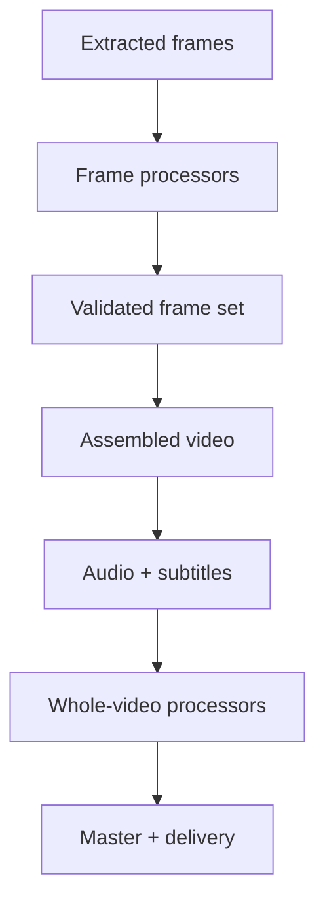

# Architecture

## System overview

`aniflow` is a thin Rust orchestration engine around specialized media tools.
It does not reimplement codecs, upscalers, watermark algorithms, stabilizers,
or artifact renderers. It builds a deterministic execution plan, invokes tools
through typed adapters or a safe command boundary, validates outputs, and
preserves resumable state.



## Components

| Module | Responsibility |
| --- | --- |
| `cli` | Parse user intent and command arguments |
| `pipeline` | Load, validate, and expand pipeline v2 YAML |
| `media` | Normalize `ffprobe` output into source metadata |
| `run` | Execute the ordered stage graph and processor chains |
| `command` | Diagnose and invoke external executables |
| `workspace` | Own safe, isolated run and stage paths |
| `state` | Persist checkpoints, artifacts, and provenance |

The project remains one crate until a real independent release or compile
boundary appears.

## Execution model

The macro pipeline is an ordered state machine. Three internal regions are
configurable processor chains:



An arbitrary DAG is intentionally deferred. The current operations transform
one complete artifact set into the next, so an ordered chain is easier to
reason about, resume, and validate.

## Adapter boundary

Frame processors satisfy one artifact contract:

```text
input frame + typed configuration
    → direct child process
    → exact output frame + exit status
```

Version 0.2.0 includes:

| Adapter | Integration |
| --- | --- |
| `gemini_watermark_remover` | Generates one native directory-mode `gwr remove` command |
| `upscayl_ncnn` | Generates one directory-mode `upscayl-bin` command with model, scale, tile, GPU, and format arguments |
| `external` | Expands input/output placeholders for concurrent per-frame custom processors |

The Gemini adapter is deliberately a CLI dependency rather than embedded
JavaScript. A future Rust implementation can replace the adapter internals
without changing pipeline structure or the run orchestrator.

Audio and whole-video processors share a generic file-to-file contract. This
already supports restoration, denoise, stabilization, interpolation, grading,
mastering, watermarking, and final effects as tools become available.

## Run state

```text
.aniflow/runs/<run-id>/
├── config/pipeline.yml
├── manifest.json
├── logs/
├── metadata/source.json
├── frames/
│   ├── source/
│   └── stages/
│       ├── 01-remove-gemini-watermark/
│       └── 02-upscale/
├── audio/
│   ├── source.wav
│   └── stages/
├── subtitles/
├── video/
│   └── stages/
├── output/master.mp4
├── renderflow/
├── delivery/manifest.json
└── state/<stage>.complete
```

A completed macro stage owns a marker. Generic per-frame stages additionally
treat an existing valid output frame as an individual checkpoint. Native batch
adapters reuse a complete output directory or rerun the batch after an
interruption. The source SHA-256 must still match before resume.

## Validation boundary

Current automatic checks:

- source and output frame counts match;
- ordered filenames correspond exactly;
- every frame is a structurally valid PNG;
- every output exceeds the configured minimum byte size;
- all output frames have consistent dimensions.

Future continuity analysis will sit behind the same validation stage and add
perceptual hashes, flicker metrics, optical-flow discontinuities, and sampled
human-review contact sheets.

## Source safety

- The source is read-only.
- Generated files remain under one run workspace.
- Final output paths cannot be absolute or contain parent traversal.
- Subtitles are snapshotted before execution.
- Resume rejects changed source content.
- Arguments are passed directly without a shell.
- A processor must create its exact declared artifact.

## Renderflow boundary

Ownership remains explicit:

| Engine | Owns |
| --- | --- |
| `aniflow` | Temporal processing, validation, and the release-ready master |
| `renderflow` | Alternate formats, previews, thumbnails, posters, transcripts, and derivatives |

The current Renderflow adapter is disabled by default. When enabled, it receives
the master and an isolated output directory. `delivery/manifest.json` is the
versioned boundary that can grow as Renderflow stabilizes.

## Evolution path

1. Process one complete `.play()` music video with the Gemini + Upscayl chain.
2. Capture actual tool versions and model checksums in provenance.
3. Add duration, output-dimension, and A/V-sync validation.
4. Add perceptual continuity checks and review sheets.
5. Add stage fingerprints and cross-run content-addressed caching.
6. Add targeted reruns and configurable retry policy.
7. Replace the Gemini CLI adapter with a Rust-native implementation.
8. Finalize and version the Renderflow handoff contract.
9. Split crates only where independent boundaries prove useful.
