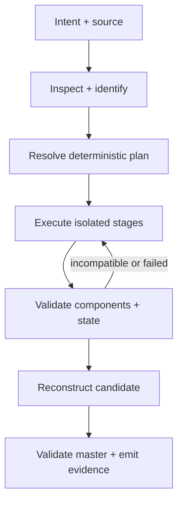

# aniflow Architecture

## Purpose and scope

This document defines how aniflow is structurally organized so its temporal
domain remains independent of delivery, external commands, filesystems, and
suite orchestration. It governs dependency direction and communication patterns,
not detailed APIs or the current module tree.

## Structural units

| Unit | Responsibilities |
| --- | --- |
| Domain | timeline, streams, artifacts, processors, stages, plans, checkpoints, validation semantics, and domain errors |
| Application | inspect, validate configuration, plan, start, resume, cancel, query status, reconstruct, and coordinate use cases |
| Ports | media probe/decode/encode, processor execution, filesystem, hashing, clock, signals, event sinks, and resource observations |
| Adapters | FFmpeg/FFprobe, external processors, local filesystem/process runtime, serialization, and future platform integrations |
| Delivery | public Rust facade, CLI argument mapping, human presentation, and versioned machine envelopes |

## Dependency direction

Dependencies point inward:

```text
CLI and other delivery adapters
        -> public aniflow facade
        -> application use cases
        -> temporal domain

external adapters -> inward-facing ports
```

The domain does not import CLI, serialization, process, or filesystem behavior.
Application code depends on ports rather than concrete tools. Adapters may use
domain and port types but cannot become alternate owners of temporal rules.

## Runtime flow



The target is a resolved stage graph, but aniflow does not adopt arbitrary DAG
complexity until a real temporal workflow needs branching or fan-in. Ordered
processor chains remain the simplest supported composition primitive.

## Public library and CLI boundary

The Rust library is the behavioral product. The CLI maps arguments into typed
requests, subscribes to events, and renders results. JSON and other machine
formats serialize versioned result contracts; console prose is not an API.

The initial extraction uses one Cargo package with a library target and binary
target. Further crate separation requires an independently useful API, compile
boundary, feature boundary, or release boundary.

## Processor boundary

Processors declare identity, capabilities, configuration, inputs, outputs, and
resource expectations. External commands use direct argument arrays without a
shell. The runtime captures stdout and stderr independently, redacts sensitive
diagnostics, forwards cancellation, observes declared outputs, and separates
process exit from artifact validation.

Typed first-party adapters translate configuration into this contract. A
generic command adapter is an explicit escape hatch, not permission to bypass
validation.

## State and checkpoint architecture

A run has an isolated workspace and an atomic manifest. Stage outputs are
immutable. State transitions preserve pending, running, validating, complete,
failed, cancelled, and skipped distinctions.

A checkpoint binds source and timeline identity, normalized plan fragment,
processor and tool identity, configuration, input digests, output digests, and
validation observations. Reuse is a compatibility decision with an explanation,
not a marker-file lookup.

Read-only operations never create or repair workspace directories implicitly.

## Communication patterns

- Typed requests and results cross application boundaries.
- Structured events report lifecycle and progress without defining state.
- Raw logs remain separate from interpreted events.
- Versioned manifests persist plans, observations, transitions, and artifacts.
- Atomic writes and explicit validation guard state changes.
- Bounded worker pools and cancellation tokens control expensive work.

## Cross-repository boundary

aniflow exposes a stable library and CLI but imports no flow, optiflow, or
renderflow code. flow may adapt aniflow's public contracts and coordinate its
master with sibling capabilities. Pipeline v2's optional renderflow field is a
deprecated compatibility seam; pipeline v3 removes cross-holon selection.

## Security and privacy constraints

Sources remain read-only, generated paths stay within explicit workspaces, and
path traversal is rejected. Configured executables run with the user's authority
and therefore remain trusted-code decisions. Secrets and unnecessary absolute
paths are excluded from persisted machine output. Remote processing, destructive
mutation, and signing require separate explicit capabilities and policy.

## Current implementation gaps

| Target boundary | v0.3.0 evidence gap |
| --- | --- |
| Versioned command results | Machine envelope and typed failures exist; independently versioned per-command result schemas await real `flow` evidence |
| Process runtime | Complete output buffered until exit; limited cancellation and capability probing |
| Deterministic plan | Human plan output without a normalized serializable digest |
| Compatible checkpoint | Completion markers do not bind configuration, tool identity, or validated outputs |
| Temporal domain | Average-frame-rate reconstruction and first-stream selection |
| Cross-holon independence | Optional renderflow invocation remains in pipeline v2 |
| Layer separation | Large orchestration module combines multiple system responsibilities |

## Assumptions and open questions

The exact domain type decomposition, event schema, and timeline representation
remain design work. They must be derived from fixtures and consumer needs while
respecting the dependency direction above.

## Validation

Architecture tests prohibit outward domain dependencies. Library examples and
CLI contract tests exercise the same application path. Temporal, interruption,
and resume fixtures validate the structural claims.
