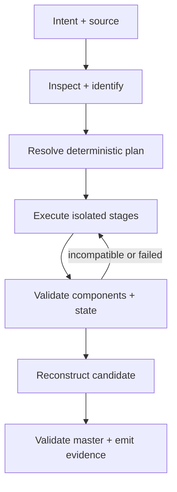

# aniflow Architecture

## Purpose and scope

This document defines how aniflow is structurally organized so its temporal
domain remains independent of delivery, external commands, filesystems, and
suite orchestration. It governs dependency direction and communication patterns,
not detailed APIs or the current module tree.

## Structural units

| Unit | Responsibilities |
| --- | --- |
| Domain | timeline, streams, artifacts, processors, stages, plans, checkpoints, validation semantics, and domain errors |
| Application | inspect, validate configuration, plan, start, resume, cancel, query status, reconstruct, and coordinate use cases |
| Ports | media probe/decode/encode, processor execution, filesystem, hashing, clock, signals, event sinks, and resource observations |
| Adapters | FFmpeg/FFprobe, external processors, local filesystem/process runtime, serialization, and future platform integrations |
| Delivery | public Rust facade, CLI argument mapping, human presentation, and versioned machine envelopes |

## Dependency direction

Dependencies point inward:

```text
CLI and other delivery adapters
        -> public aniflow facade
        -> application use cases
        -> temporal domain

external adapters -> inward-facing ports
```

The domain does not import CLI, serialization, process, or filesystem behavior.
Application code depends on ports rather than concrete tools. Adapters may use
domain and port types but cannot become alternate owners of temporal rules.

## Runtime flow


```mermaid
flowchart TD
    Intent["Intent + source"] --> Inspect["Inspect + identify"]
    Inspect --> Plan["Resolve deterministic plan"]
    Plan --> Execute["Execute isolated stages"]
    Execute --> Validate["Validate components + state"]
    Validate --> Reconstruct["Reconstruct candidate"]
    Reconstruct --> Master["Validate master + emit evidence"]
    Validate -->|incompatible or failed| Execute
```

The target is a resolved stage graph, but aniflow does not adopt arbitrary DAG
complexity until a real temporal workflow needs branching or fan-in. Ordered
processor chains remain the simplest supported composition primitive.

## Public library and CLI boundary

The Rust library is the behavioral product. The CLI maps arguments into typed
requests, subscribes to events, and renders results. JSON and other machine
formats serialize versioned result contracts; console prose is not an API.

The initial extraction uses one Cargo package with a library target and binary
target. Further crate separation requires an independently useful API, compile
boundary, feature boundary, or release boundary.

## Processor boundary

Processors declare identity, capabilities, configuration, inputs, outputs, and
resource expectations. External commands use direct argument arrays without a
shell. The runtime captures stdout and stderr independently, redacts sensitive
diagnostics, forwards cancellation, observes declared outputs, and separates
process exit from artifact validation.

Typed first-party adapters translate configuration into this contract. A
generic command adapter is an explicit escape hatch, not permission to bypass
validation.

The provider-native contracts cover declarations, effective configuration,
compatibility fingerprints, explicit local registration, deterministic
resolution, standalone locks, lifecycle events, and bounded execution reports.
The local runtime re-verifies executable identity before launch, terminates
process groups on Unix, and accepts completion only after strict artifact
validation. Pipeline v2 frame, batch, audio, and whole-video adapters now use
that runtime and add temporal validation before promoting temporary output.

Pipeline v3 adds one closed provider invocation ABI:
`<executable> --aniflow-invocation <request-path>`. The ephemeral request binds
the exact provider-lock digest, effective configuration, and typed input and
output ports, including whether each artifact is a file or directory. Runtime
paths enable the local invocation but do not enter durable compatibility
identity. The executor supports exactly one artifact on each `one` output
port and an explicitly planned nonempty member set on `one_or_more` or `many`
ports. Every member retains a unique artifact ID and disjoint exact path.
The #69 extension selects invocation/report v2 for stages declaring multi-artifact
ports; all-`one` stages keep v1. Report schema and invocation semantics remain
bound into reuse identity, and no member may be discovered after planning.
Every artifact receives mandatory built-in
`aniflow.validation/artifact-integrity/v1`. #33 adds explicit inline
provider-artifact and temporal-media gates, with exact locks resolved during
planning and aniflow-owned acceptance. Unsupported cardinality/profiles,
lifecycle-observer stages and publish authority are rejected before mutation
or launch. See [layered validation](../../layered-validation.md) and
[proposed ADR-0008](../governance/decisions/ADR-0008-layered-validation-acceptance.md).
The #33 and #69 implementations are authored with test/check execution deferred
under #64. ADR-0008 records the bounded extension without claiming acceptance.

## Native audio evidence boundary

Issue #80 extends the existing inspection adapter with classic RIFF32 PCM24
and finite IEEE float32 alongside PCM16. Technical report v2 and provider v2
bind native sample encoding, exact source/sample digests and same-encoding decode
verification. Historical technical v1 remains readable. A new signal v3 companion
and explicit native settings use source-format full-scale ratios; they never
reinterpret PCM16 thresholds or clamp floating-point headroom. Native loudness
and true-peak methods are explicitly unavailable in this bounded implementation.
The legacy PCM16 signal algorithms and historical companions retain their meanings.

Model-backed musical, transcription, alignment and MIDI consumers remain PCM16
profiles and reject broader samples before inference. All profiles use the same
Pipeline v3 source, provider, checkpoint and resume owners. Native format
acceptance does not imply platform qualification, a model's compatibility,
creative approval or media finishing. See [the native audio handoff](../../validation/aniflow-80-checkpoint.md)
and the companion note in [proposed ADR-0006](../governance/decisions/ADR-0006-audio-analysis-foundation.md).

## State and checkpoint architecture

The first typed audio-separation provider uses that existing ABI with vocals,
accompaniment, and evidence output ports. Its bounded PCM WAV profile validates
sample integrity and duration before returning candidate outputs. The host's
built-in integrity validation remains a separate completion gate. A thin local
preparation/task adapter records and rechecks external model/tool identities
before invoking the public run/resume path; the model cache stays outside run
artifacts. This is a specialization of the existing external-tool boundary,
not an alternate execution or checkpoint owner. See
[offline Demucs](../../offline-demucs.md) for its precise support limits.

The bounded [stem-lineage importer](../../audio-stem-lineage.md) selects an
accepted prior separation output through declared artifact roles and verified
Pipeline v3 records. The public analysis facade retains the mix/stem relationship
without interpreting provider-native JSON. Ordinary inspection/signal stages
measure the selected full stem, followed by a lineage stage that emits the final
normalized analysis. This is explicit input import into a new run, not another
checkpoint owner, a general completion gate or automatic cross-run reuse.
[Proposed ADR-0007](../governance/decisions/ADR-0007-provider-neutral-stem-import.md)
records the boundary and its direct-mix, full-selection and duration limits.

A Pipeline v3 run has an isolated workspace, an immutable plan snapshot,
append-only self-validating run-manifest revisions, and immutable stage
checkpoints. Stage outputs are immutable. State transitions preserve pending,
running, validating, complete, failed, cancelled, invalidated, and skipped
distinctions. A checkpoint is published only after its provider report, output
observations, and required validations are durable.

A checkpoint binds the relevant stage-plan fragment, exact provider lock,
invocation and execution semantics, ordered input and dependency identities,
provider execution-report identity, output kind/count/size/content, and typed
validation observations. Reuse is a compatibility decision with an
explanation, not a marker-file lookup. Resume re-resolves explicitly supplied
provider registrations and requires the complete lock to equal the plan before
it can reuse or execute a stage. Changed source or provider authority fails
closed; changed accepted output invalidates the affected stage and its
downstream consumers.

Run-state updates never replace prior revisions, and checkpoints never replace
prior evidence. `status_v3` and other read-only operations never create or
repair workspace directories implicitly. Pipeline v2 retains its existing
workspace and completion-marker behavior as a compatibility boundary.

## Communication patterns

- Typed requests and results cross application boundaries.
- Structured events report lifecycle and progress without defining state.
- Raw logs remain separate from interpreted events.
- Versioned manifests persist plans, observations, transitions, and artifacts.
- Atomic writes and explicit validation guard state changes.
- Bounded worker pools and cancellation tokens control expensive work.

## Cross-repository boundary

aniflow exposes a stable library and CLI but imports no flow, optiflow, or
renderflow code. flow may adapt aniflow's public contracts and coordinate its
master with sibling capabilities. Pipeline v2's optional renderflow field is a
deprecated compatibility seam; pipeline v3 removes cross-holon selection.

## Security and privacy constraints

Sources remain read-only, generated paths stay within explicit workspaces, and
path traversal is rejected. Configured executables run with the user's authority
and therefore remain trusted-code decisions. Secrets and unnecessary absolute
paths are excluded from persisted machine output. Remote processing, destructive
mutation, and signing require separate explicit capabilities and policy.

## Current implementation gaps

| Target boundary | v0.3.0 evidence gap |
| --- | --- |
| Versioned command results | Machine envelope and typed failures exist; independently versioned per-command result schemas await real `flow` evidence |
| Provider contract | Provider-native declarations, fingerprints, standalone resolution, exact locks, and bounded local execution cover all pipeline v2 processor families |
| Process runtime | Pipeline v2 processors use bounded provider execution; FFmpeg/FFprobe and the deprecated renderflow handoff remain legacy adapters outside this checkpoint |
| Deterministic plan | Pipeline v3 has a canonical self-validating plan; Pipeline v2 retains its compatibility planner |
| Compatible checkpoint | Pipeline v3 has immutable content-aware checkpoints and append-only run manifests; Pipeline v2 retains legacy completion markers |
| Temporal domain | Average-frame-rate reconstruction and first-stream selection |
| Cross-holon independence | Optional renderflow invocation remains in pipeline v2 |
| Layer separation | Large orchestration module combines multiple system responsibilities |

## Assumptions and open questions

The exact domain type decomposition and timeline representation remain design
work. Pipeline v3 execution is intentionally an ordered bounded subset with
explicit nonempty output-member sets, mandatory per-member integrity and
explicit inline validation profiles. Optional/unbound ports, zero-output stages
and dynamic fan-out remain refused. Arbitrary DAGs await separate evidence;
#34's optional cross-run reuse requires exact origin proof and current
acceptance. `validation` owns public observation and
acceptance contracts, while `run_v3::validation_gate` connects them to exact
runtime locks, checkpoints, status and final delivery.
Provider lifecycle events are versioned at execution granularity; native
item-count and fractional progress await real provider protocol evidence.

## Validation

Architecture tests prohibit outward domain dependencies. Library examples and
CLI contract tests exercise the same application path. Temporal, interruption,
and resume fixtures validate the structural claims.

## Owned local stage reuse (#34)

`cache_v3` owns explicit namespace policy, sealed storage, locks, bounded inventory
and retention operations. `run_v3::cache_gate` bridges exact stage identities and
origin evidence into the existing current-plan acceptance path. Producers may be
reused; required current validators still execute. The CLI delegates to public
library operations, and Flow receives versioned decisions/diagnostics. Source and
run data stay outside the cache ownership boundary. Read-only APIs never perform
cleanup. Pending reruns and excluded checkpoints live in the run manifest.

See [the proposed cache ADR](../governance/decisions/ADR-0009-owned-stage-cache.md)
and [implementation specification](../../specs/content-addressed-reuse.md).
Qualification remains deferred under #64; architecture implementation is not
native-platform or release evidence.
