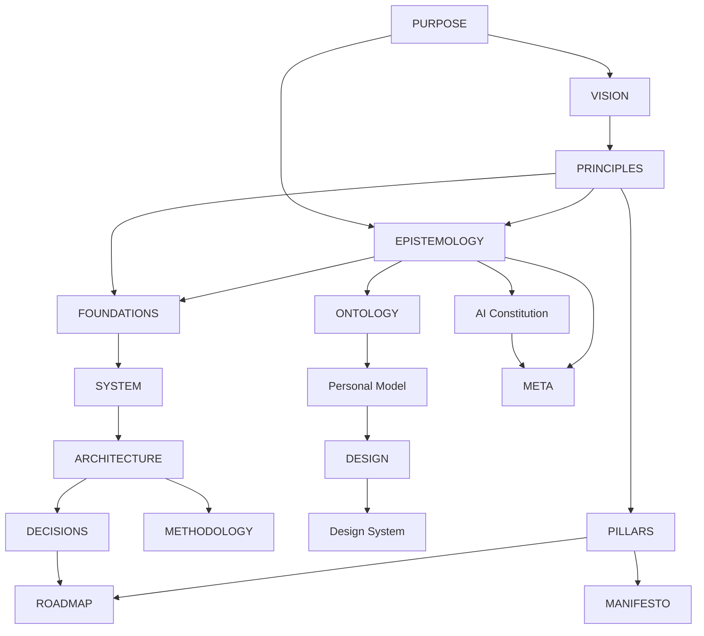

# Aniflow Meta Architecture

## Architecture-system overview

Aniflow's architecture is an 18-document graph materialized from the Aether architecture specifications. Each document owns one bounded concern. This index maps ownership and relationships without replacing the documents themselves.

## Document inventory

| Artifact | Path | Category | Status | Governing specification | Upstream dependencies |
| --- | --- | --- | --- | --- | --- |
| aniflow-purpose | [PURPOSE.md](../identity/PURPOSE.md) | Identity | draft | architecture-purpose | — |
| aniflow-vision | [VISION.md](../identity/VISION.md) | Identity | draft | architecture-vision | aniflow-purpose |
| aniflow-principles | [PRINCIPLES.md](../identity/PRINCIPLES.md) | Identity | draft | architecture-principles | aniflow-purpose, aniflow-vision |
| aniflow-pillars | [PILLARS.md](../identity/PILLARS.md) | Identity | draft | architecture-pillars | aniflow-purpose, aniflow-vision, aniflow-principles |
| aniflow-manifesto | [MANIFESTO.md](../identity/MANIFESTO.md) | Identity | draft | architecture-manifesto | aniflow-purpose, aniflow-vision, aniflow-principles, aniflow-pillars |
| aniflow-epistemology | [EPISTEMOLOGY.md](EPISTEMOLOGY.md) | Meta | draft | architecture-epistemology | aniflow-purpose, aniflow-principles |
| aniflow-ai-constitution | [AI_CONSTITUTION.md](AI_CONSTITUTION.md) | Meta | draft | architecture-ai-constitution | aniflow-purpose, aniflow-vision, aniflow-principles, aniflow-epistemology |
| aniflow-ontology | [ONTOLOGY.md](../domain/ONTOLOGY.md) | Domain | draft | architecture-ontology | aniflow-purpose, aniflow-vision, aniflow-principles, aniflow-epistemology |
| aniflow-personal-model | [PERSONAL_MODEL.md](../domain/PERSONAL_MODEL.md) | Domain | draft | architecture-personal-model | aniflow-purpose, aniflow-vision, aniflow-principles, aniflow-epistemology, aniflow-ontology |
| aniflow-foundations | [FOUNDATIONS.md](../foundation/FOUNDATIONS.md) | Foundation | draft | architecture-foundations | aniflow-purpose, aniflow-principles, aniflow-epistemology |
| aniflow-system | [SYSTEM.md](../foundation/SYSTEM.md) | Foundation | draft | architecture-system | aniflow-foundations, aniflow-ontology |
| aniflow-architecture | [ARCHITECTURE.md](../foundation/ARCHITECTURE.md) | Foundation | draft | architecture-architecture | aniflow-foundations, aniflow-system |
| aniflow-methodology | [METHODOLOGY.md](../foundation/METHODOLOGY.md) | Foundation | draft | architecture-methodology | aniflow-principles, aniflow-epistemology, aniflow-ai-constitution, aniflow-foundations, aniflow-architecture |
| aniflow-design | [DESIGN.md](../experience/DESIGN.md) | Experience | draft | architecture-design | aniflow-purpose, aniflow-vision, aniflow-principles, aniflow-personal-model |
| aniflow-design-system | [DESIGN_SYSTEM.md](../experience/DESIGN_SYSTEM.md) | Experience | draft | architecture-design-system | aniflow-personal-model, aniflow-design |
| aniflow-decisions | [DECISIONS.md](../governance/DECISIONS.md) | Governance | draft | architecture-decisions | aniflow-principles, aniflow-epistemology, aniflow-foundations, aniflow-system, aniflow-architecture |
| aniflow-roadmap | [ROADMAP.md](../../../ROADMAP.md) | Foundation | draft | architecture-roadmap | aniflow-vision, aniflow-pillars, aniflow-architecture, aniflow-decisions |
| aniflow-meta | [META.md](META.md) | Meta | draft | architecture-meta | aniflow-epistemology, aniflow-ai-constitution |

## Relationship graph

## Ownership map

- Identity documents own why the repository exists, its desired future, decision heuristics, strategic capabilities, and public commitments.
- Meta documents own knowledge integrity, AI authority, and navigation of this document system.
- Domain documents own canonical concepts and bounded human assumptions.
- Foundation documents own invariants, logical systems, structure, working method, and strategic evolution.
- Experience documents own intended experience and reusable semantic design language.
- Governance owns accepted architectural decisions and historical lineage.

## Reading order

1. PURPOSE, VISION, and PRINCIPLES.
2. EPISTEMOLOGY and ONTOLOGY.
3. FOUNDATIONS, SYSTEM, and ARCHITECTURE.
4. PERSONAL_MODEL, DESIGN, and DESIGN_SYSTEM when evaluating human-facing surfaces.
5. AI_CONSTITUTION before delegating consequential work.
6. DECISIONS and ROADMAP for accepted constraints and evolution.

## Authoring order

Follow the dependency graph from purpose through identity and evidence, then domain and foundations, experience, governance, roadmap, and finally this META index.

## Lifecycle and validation

All documents begin as draft and require human review before becoming active. Validation covers frontmatter, stable identifiers, links, graph acyclicity, ownership boundaries, evidence labels, Markdown structure, and agreement with repository reality.

## Change propagation

A material upstream change triggers review of every downstream node. Implementation changes first update the owning specification or decision when they alter durable behavior; META changes whenever inventory or relationships change.

## Gaps and omissions

- No document in this set is intentionally omitted because Aniflow has repository, automation, human, AI, and public or documentation surfaces that justify the complete reference set.
- Target systems remain provisional where implementation evidence is absent.
- Repository-local schemas and automated graph validation should be added or connected to Aether in a later conformance pass.

## Evidence and uncertainty

- **Observed:** The repository README and checked-in implementation establish a reproducible, resumable Rust orchestrator for frame-based video transformation and reconstruction.
- **Decided for this draft:** The repository owns the bounded concern described here and participates through versioned contracts.
- **Proposed:** Target systems and later roadmap phases remain proposals until accepted and implemented.
- **Open question:** Which parts of this draft should become active in the first independently versioned release?
