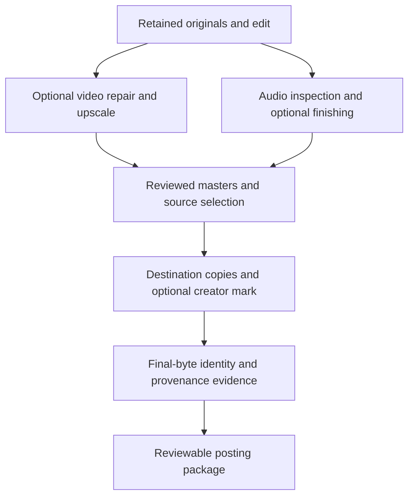

# Audio and video release preparation

Version: 0.1.0 · Captured: 2026-10-02 · Status: exploratory proposal and manual workflow

Parent: [#79](https://github.com/egohygiene/aniflow/issues/79).
First pilot: **Akashic**, the song/video project. It is distinct from the masked
character of the same name. This checkpoint describes preparation; no media has
been processed, proof verified, master approved or content published here.

Start with the [manual runbook](../media-release-preparation.md) and copy the
[receipt template](../templates/media-release-receipt.md) into private project
storage. Creative continuity, lyrics, character sheets, storyboards, references,
conversation exports and actual asset locators remain in the private Catalog.
This public document contains reusable technical policy only.

## Intent and maturity

Preserve the work we are doing manually now, then automate recipes that prove
useful. The workflow is evolving: a proposed provider, a successful command, a
reviewed candidate, an approved master and a qualified Aniflow release are
different states. Keep manual import and skip/no-go outcomes first-class.

The useful computer-science improvements are exact asset lineage, recoverable
processing, versioned export profiles, independent checks and durable evidence.
Public media can still be copied. Preservation, attribution, existence evidence,
reuse detection and response readiness address different problems.

The baseline should remain inexpensive and usable before a platform or brand is
fully built. A signing certificate, GPU watermark model or account API integration
is not required to finish the first project. No numeric "security score" or
universal ownership claim is defined.

## Current repository evidence

Inspected Aniflow main `48ea034897d27438fbec526e01d7e65a98104955`, its README,
ROADMAP, CONTRIBUTING, audio inspection/signal/workflow guides and temporal guide.
Existing issues #35–#40 already capture the field workflow and unqualified parts.

| Surface | Current evidence | Consequence for the pilot |
| --- | --- | --- |
| Selective repair and upscaling | #35–#38 retain the reported manual frame-workspace workflow and missing packaging/recovery behavior | Adopt recovered work with its actual evidence; do not regenerate unnecessarily or invent a historical provider lock |
| Audio inspection | Closed #13/#43/#44/#51 implement a bounded PCM16 RIFF WAV profile | Native PCM24/float32 masters need #80; converting to PCM16 changes the measurement subject |
| Audio processing | Existing provider interfaces can run explicitly configured external audio operations | No mastering/enhancement model or recipe is selected by this spec |
| Timing, acceptance and caches | #32/#33/#34 implementation is merged; broad qualification is deferred under #64 | Implementation is not a claim that the new pipeline is tested or released |
| Pipeline v2 assembly | README describes extracted PCM24 and 320 kbps AAC audio restoration | Do not assume bit-exact approved-audio passthrough or tail preservation; #35 owns the stronger composition contract |
| Invisible-watermark cleanup | #39 retains a separate, unqualified short-clip experiment | Optional research; never a prerequisite for export or an undetectability promise |
| Distribution | #10/#40 and downstream Flow #51/#75 own independently qualified releases | Do not change the active product execution order or consume unreleased sibling source code |

The private Akashic packet contains reported video dimensions/timing, repair
ranges, an original float32 audio source and a reference excerpt. These are
recovery leads. Current file bytes, hashes, tool settings, completed workspace,
latest edit, loudness and approval still require direct inspection. No historical
filename or prior assistant measurement becomes a fresh observation.

## Pipeline and checkpoint order

Every branch retains its input. Rejected experiments remain separate; they never
silently replace an approved mix or master. The graph describes logical stages,
not implemented command names. Publication is a separate action after preparation.

### 1. Preserve and inspect

Recover originals, current editing project, approved source references and
completed repair/upscale outputs. Record exact bytes/size/hash and an actual
restore check from independent storage. A Git link, OTS proof or unresolved asset
locator is not a recovered backup. Retain authored lyrics, drawings, scene/character
revisions, edit decisions, contributor records and tool/model/license observations
with their real source and capture date.

Inspect actual video streams, rational timestamps, dimensions, color/range,
rotation and frame identity. Inspect original audio format, channel order,
sample-frame count, rate, duration, sample/true peak and loudness using declared
methods. Unsupported analysis remains explicit. A converted PCM16 compatibility
copy can be analyzed as a derivative but cannot stand in for a float32 baseline.

Source access is read-only in ordinary processing. Use owned working directories,
explicit tool/model preparation, bounded execution and recoverable checkpoints.
Existing #32/#33/#34/#38 contracts own those mechanisms.

### 2. Video branch

Optional visible-overlay repair selects exact approved frame/time ranges; clean
frames stay unchanged at that stage. Verify cardinality and temporal mapping
before reinsertion. Preserve color semantics and the current clean frame set.
Upscaling records native model scale separately from requested output scale,
binary/model identity, device/settings and actual output geometry.

Review line art, faces/hands, text, tears/light effects, transitions and temporal
flicker against the intended scene. More pixels do not prove better quality.
Keep the desired 4K archival master; create smaller delivery copies when selected.
Reuse #35–#38 rather than writing another frame runner.

The optional cleanup experiment #39 is distinct from adding our own mark. Retain
upstream generation/processing evidence regardless of a selected cleanup. Never
use a generic AI classifier or an empty tag list as proof of watermark absence.

### 3. Audio branch

Begin with the original approved mix. Inspect it before proposing gain, limiting,
EQ/restoration, resampling, stem processing or AI enhancement. An audio "upscale"
is not automatically a fidelity improvement; recreated material needs listening
and explicit approval. AudioSR and AudioSeal are candidates, not selected tools.

Keep optional candidates separate and compare at matched listening volume.
Record source-relative timing, channel order, phase/stereo image, bandwidth,
sample count, loudness, peaks and the complete tail. Preserve float headroom in
native baseline analysis; do not clamp or quantize to make an analyzer accept it.
PCM precision/rate changes, dither and mastering settings belong in transform
evidence. Never apply an invented universal -14 LUFS rule to every destination.

### 4. Select sources and assemble

Record the exact reviewed video and audio identities, offset, start/end mapping
and any explicitly approved duration change. Compressed audio extracted from a
video is a different source from the original lossless mix. Decoding a lossy
stream to WAV does not recover information lost in the codec.

Preserve rational frame/sample clocks and approved audio tails. A default AAC
restore or shortest-stream truncation is not acceptable merely because a command
finishes. Passthrough is selected only where compatible and verified; re-encoding
and its timing/quality effects are explicit. Keep archival masters independent
of delivery copies and creator watermark experiments.

### 5. Export and creator attribution

Create only selected destination versions. An optional invisible creator mark is
applied after destructive cleanup/upscale/finishing and before the last delivery
encode. Its acceptance check uses the final encoded file. Document any different
ordering required by a qualified provider. Default visible branding stays off,
preserving the artist's existing no-visible-watermark delivery policy.

Descriptive metadata uses a reviewed preserve/minimal/allowlist policy. Add only
truthful approved artist/title/credit information. Preserve structural decoding
fields and retain original provenance privately. Signed credentials, invisible
signal marks, visible overlays and ordinary tags have separate inspection and
editing semantics. Tag removal cannot certify complete sanitization.

| Destination | Proposed starting copy | Current primary-source evidence and scope |
| --- | --- | --- |
| TikTok manual posting | Portrait 1080×1920 H.264 MP4, SDR/yuv420p/faststart, approved frame rate; explicit audio encode | API guide [S7] recommends MP4/H.264, permits 23–60 fps and 360–4096 pixels per axis; it does not define every manual-app limit. Verify actual route/account duration before full-song delivery |
| SoundCloud | Lossless PCM WAV or FLAC from the approved mix, retaining native rate where supported | Upload guide [S9] recommends lossless WAV/FLAC/AIFF/ALAC. Paid mastering is a different product/contract; no automatic mastering request is implied |
| DistroKid | Supported PCM WAV or FLAC, full approved song and reviewed release metadata | [S10] accepts several formats and calls 16-bit/44.1 kHz WAV typical, not mandatory; maximum upload is 1 GB. Verify the selected delivery specification rather than unnecessarily down-converting |

These are proposals checked on 2026-10-02, not finished exports. Lossless PCM
delivery can still change a float source through quantization/gain/dither.
Container extension alone does not prove suitability. Platform compression can
change sound/image quality and remove metadata, so keep our original final bytes.

Do not promise a personal TikTok Direct Post utility: developer guidelines [S8]
reject internal-only account-upload tools and restrict integration-added promotional
branding/watermarks. Future API integration needs its own approved product and
route review, including the proposed invisible mark. Prepare a manual package
first. Check applicable AI disclosure guidance at actual posting [S13]; metadata
cleanup does not change how the work was generated.

### 6. Seal exact-byte evidence

Finish signal/pixel changes, container export and descriptive metadata first.
If supported C2PA is expressly selected, embed/sign and validate it next. Then
hash and timestamp the final exact bytes. Earlier originals and milestones may
also have their own independent proofs. New bytes always receive a new identity.

A fixed subject manifest can list original/master/delivery SHA-256 hashes, sizes,
parent relationships and evidence-document identities. Keep its exact bytes and
all referenced files. Exclude itself, its .ots proof and later verification
receipts from its own inventory. Proof/status observations are separate, versioned
append-only records, so upgrading a proof cannot invalidate the subject manifest.

OTS states distinguish requested/pending, anchored, verified, failed and unavailable.
Retain proof digests, upgrade history, verification time, verified existence bound
and method/trust dependencies. The official Python client documents local Bitcoin
Core verification; third-party web/explorer verification has different trust
assumptions [S2]. Stamp submission alone is not observed verification.

Keep actual file bytes and detached proofs backed up together and restore-check
one pair. Publishing a hash/proof or committing it to GitHub can aid later
inspection but cannot authenticate an ownership claim by itself. Independent
timestamping does not reveal the private source file merely to establish its
existence bound [S1]. No timestamp operation was run in this checkpoint.

## Protection comparison and decisions

The following recommendations are an engineering assessment of the cited
mechanisms, not a claim that they establish rights in this project.

| Mechanism | Threat addressed / evidence | Limit and compatibility | Cost and decision |
| --- | --- | --- | --- |
| Retained originals, edit history and independent restored backup | Loss/overwrite; recoverable source and human decision history | A hash or Git pointer cannot replace missing media; self-reported timestamps need their origin recorded | Baseline; existing storage plus ordinary operational effort |
| SHA-256 lineage and fixed manifests | Exact-byte integrity and source/derivative relationships | Transcoding changes hashes; digest possession alone says nothing about ownership | Local and inexpensive; automate through existing evidence contracts |
| OTS [S1/S2] | Independently verifiable upper bound on exact data's existence | Not exact creation time, authorship, ownership or copyright registration; proof lifecycle/verifier dependencies matter | Free public calendars; baseline candidate with bounded networking |
| Approved descriptive metadata | Portable artist/title/credit hints | Easy to edit/strip and not authenticated; route support varies | Low effort; explicit allowlist and post-export inspection |
| C2PA [S3/S4] | Signed, tamper-evident provenance assertions | No DRM; manifests may be stripped; valid crypto and verifier trust are separate. Soft-binding lookup needs supporting infrastructure | Optional/deferred; trusted signing/key operations add maintenance and possibly cost |
| Invisible creator mark [S5/S6] | Embedded ID/detection clue after some changes | Provider-specific quality, robustness, collisions and spoofing limits; stereo music and real platform survival unqualified | Optional experiment; compute/model/device costs remain unknown until measured |
| Perceptual fingerprints | Candidate matching for transformed excerpts/copies | Different from exact hashes; not an ownership verdict, searchable coverage or automatic enforcement | Later optional matching adapter, with false-positive human review |
| Private access and safe key handling | Pre-release disclosure, account/key compromise | Public posting still exposes the work; recovery and least-privilege controls need maintenance | Keep masters/creative packets private, keys outside Git and tokens out of logs; no account changes here |
| Rights review and registration [S11/S12] | Legal eligibility and response preparation | U.S. copyright protects expression, not ideas; AI output eligibility depends on human expression. Timestamp/signature/mark is not registration | Separate deliberate review; no filing, fee or ownership determination here |

For AI-assisted work, retain authored lyrics/text/drawings, creative editing and
arrangement decisions, and references that show actual human expression. Prompt
history helps explain the process but does not itself make generated output
copyrightable under U.S. Copyright Office guidance [S11]. Determine actual
contributions and chain of rights before choosing a registration route [S12].

C2PA's signed credentials do not restrict copying; screenshots or stripped files
can lose embedded provenance. Durable credentials may reconnect a copy through
watermarks/fingerprints but depend on compatible implementations and lookup [S3/S4].
An opaque creator ID should resolve to retained full asset evidence. Small public
payloads do not constitute a cryptographic signature or an authenticated identity.

One concrete candidate risk: the upstream combined VideoSeal/AudioSeal demo
resamples to 16 kHz, averages stereo to mono, then duplicates the watermarked mono
back to all channels [S6]. Refuse that path for an approved stereo music master.
VideoSeal/PixelSeal candidates and the speech-oriented AudioSeal model [S5/S14]
require distinct, pinned evaluations; no model is installed or endorsed here.

Keep detection observations separate from quality approval. Evaluate short cues,
negative controls, false positives and final-codec recovery before larger runs.
A simulation of platform encoding is not a platform test. An inconclusive or
failed creator-mark experiment is a useful result and leaves clean delivery usable.

## Ownership and bounded follow-ups

This spec follows existing ownership rather than creating a parallel media,
provenance, publication or account-management platform.

| Work | Owner / issue |
| --- | --- |
| Manual checkpoint and Akashic pilot decisions | [#79](https://github.com/egohygiene/aniflow/issues/79), private Catalog project packet |
| Selective repair, upscale, recovery and composition | #35–#38; #39 only for optional invisible-cleanup research |
| Native PCM24/float32 inspection | [#80](https://github.com/egohygiene/aniflow/issues/80), extending the existing bounded audio analyzers |
| Creator watermark qualification | [#81](https://github.com/egohygiene/aniflow/issues/81), existing optional provider interfaces |
| Media evidence bundle / OTS handoff | [#82](https://github.com/egohygiene/aniflow/issues/82), coordinated with Catalog receipts and Flow orchestration |
| Destination export and validation | [#83](https://github.com/egohygiene/aniflow/issues/83), extending #35 and using Renderflow conversion/hygiene policy |
| Shared timing, validation, caches and fixtures | #32/#33/#34/#24; deferred qualification #64 |
| Independent product release and consumption | #10/#40, Flow #51/#75 |
| Creative assets, approvals, proof inventory and broader protection policy | Private Catalog #43/#45/#62/#63/#64/#66 |
| Cross-tool sequencing and publication authority | Flow; Aniflow prepares evidence, never silently publishes |

Actual implementations must recheck current main, applicable instructions,
dependencies and contracts. The active #24 → #10 → Flow #51 product lane remains
unchanged. Reusable automation follows an evidenced manual recipe, using existing
provider registration/locks, immutable stages and typed outcomes. Do not turn a
report-only receipt into an authenticated runtime contract or invent future CLI
flags here. Real-media runs and release decisions remain later checkpoints.

## Sources and verification scope

Primary sources checked **2026-10-02**. Live requirements and model interfaces
must be rechecked before execution. This document records researched capabilities,
proposals and historical leads; it contains no new media measurements or executed
OTS/C2PA/watermark/backup tests. Documentation link/content checks do not discharge
#64's deferred compiler, test, lint, schema, smoke, package or CI qualification.

- **S1:** [OpenTimestamps](https://opentimestamps.org/).
- **S2:** [Official OpenTimestamps client](https://github.com/opentimestamps/opentimestamps-client).
- **S3:** [C2PA FAQ](https://c2pa.org/faqs/).
- **S4:** [Content Authenticity Initiative FAQ](https://opensource.contentauthenticity.org/docs/getting-started/faqs/).
- **S5:** [VideoSeal model repository](https://github.com/facebookresearch/videoseal), including the current model zoo.
- **S6:** [VideoSeal combined audio/video example](https://github.com/facebookresearch/videoseal/blob/main/inference_av.py); mutable upstream code, pin before execution.
- **S7:** [TikTok Content Posting API media guide](https://developers.tiktok.com/doc/content-posting-api-media-transfer-guide).
- **S8:** [TikTok developer content sharing guidelines](https://developers.tiktok.com/doc/content-sharing-guidelines).
- **S9:** [SoundCloud upload requirements](https://help.soundcloud.com/hc/en-us/articles/360039171614-Upload-Requirements) and [high-quality streaming](https://help.soundcloud.com/hc/en-us/articles/360051838074-High-Quality-Streaming).
- **S10:** [DistroKid accepted audio files](https://support.distrokid.com/hc/en-us/articles/360013647753-What-Audio-File-Formats-Can-I-Upload).
- **S11:** [U.S. Copyright Office AI copyrightability conclusions](https://www.copyright.gov/newsnet/2025/1060.html).
- **S12:** [U.S. Copyright Office copyright basics](https://www.copyright.gov/what-is-copyright/) and [registration FAQ](https://www.copyright.gov/help/faq/faq-general.html).
- **S13:** [TikTok AI-generated-content help](https://support.tiktok.com/en/using-tiktok/creating-videos/ai-generated-content/); search-visible policy, direct retrieval redirected and was unavailable in this check. Reverify at posting.
- **S14:** [Official AudioSeal repository](https://github.com/facebookresearch/audioseal).
